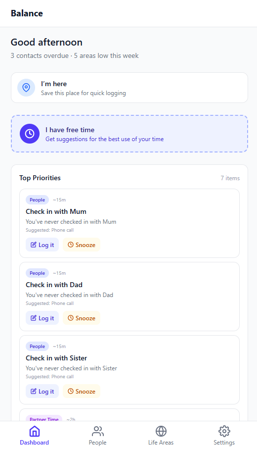

# Balance

A mobile-first web app for busy parents who are stretched thin across work, parenting, relationships, and personal needs. Balance helps you stay intentionally connected with the people who matter, take care of yourself, and make the most of whatever free time appears — without needing the mental bandwidth to think about it all holistically.



## Features

- **Relationship tracking** — Organise people into tiers (partner, close family, extended family, close friends, wider friends) with configurable check-in frequencies. See at a glance who you're overdue to contact.
- **Life area balancing** — Track time spent across self-care, DIY/household, partner time, social life, and personal goals. Visualise how balanced your week is with a live chart.
- **Priority dashboard** — An always-up-to-date view of what needs attention most, scored by how overdue things are, relationship closeness, and life area imbalance.
- **"I have free time" mode** — Tell it how much time you have and your energy level. It suggests the best use of that time based on what's most overdue and what will bring you back into balance.
- **Household tasks & goals** — Track DIY jobs with time estimates and priorities. Set personal goals with milestones and progress tracking.
- **Date night reminders** — Recurring reminders with a random idea picker.
- **Location awareness** — Save places, get contextual prompts when you arrive somewhere ("You're near Mum's house — log a visit?"), and track visit history.
- **Partner sync** — Both partners use the app on their own devices and sync data directly between them via WebRTC. The priority algorithm is partner-aware — if your partner already called Mum this week, her priority drops for you.
- **Dark mode** — Light, dark, and system-following themes.
- **Backup & restore** — Export all data as JSON. Import on a new device with merge or full replace.

## Privacy & Architecture

Balance has **no backend**. There are no servers, no databases, no accounts, and no analytics.

- All data lives locally in the browser using IndexedDB (via [Dexie.js](https://dexie.org/))
- Devices sync directly over [WebRTC](https://webrtc.org/) peer-to-peer data channels
- QR codes are used only for the initial connection handshake — actual data flows over the direct connection with no size limits
- The app works entirely offline after the first visit (PWA with service worker precaching)
- Location data stays on-device — no external geocoding or map APIs

## Tech Stack

| Layer | Technology |
|-------|-----------|
| Framework | [Next.js](https://nextjs.org/) 16 with TypeScript |
| Styling | [Tailwind CSS](https://tailwindcss.com/) v4 |
| Local storage | [Dexie.js](https://dexie.org/) (IndexedDB) |
| Peer-to-peer | WebRTC Data Channels |
| QR codes | [react-qr-code](https://www.npmjs.com/package/react-qr-code) + [html5-qrcode](https://www.npmjs.com/package/html5-qrcode) |
| Compression | [lz-string](https://www.npmjs.com/package/lz-string) (SDP signalling) |
| Service worker | [Workbox](https://developer.chrome.com/docs/workbox) (precache-first) |
| Testing | [Jest](https://jestjs.io/) + [React Testing Library](https://testing-library.com/) + [Playwright](https://playwright.dev/) |

## Getting Started

### Prerequisites

- [Node.js](https://nodejs.org/) 20+
- npm

### Install & Run

```bash
npm install
npm run dev
```

Open [http://localhost:3000](http://localhost:3000) in your browser.

### Build for Production

```bash
npm run build
```

This generates a fully static site in the `/out` directory, including the service worker and precache manifest. You can serve it with any static file server:

```bash
npx serve out
```

## Scripts

| Command | Description |
|---------|-------------|
| `npm run dev` | Start the development server |
| `npm run build` | Static export to `/out` + generate service worker |
| `npm run lint` | Run ESLint |
| `npm run format` | Format code with Prettier |
| `npm run test` | Run unit and component tests |
| `npm run test:unit` | Unit tests only (pure logic, node environment) |
| `npm run test:component` | Component tests only (jsdom, React Testing Library) |
| `npm run test:e2e` | Playwright end-to-end tests (requires build output) |

## Deployment

The app deploys automatically to GitHub Pages on push to `main` via the included GitHub Actions workflow (`.github/workflows/deploy.yml`). The workflow runs lint, unit tests, component tests, builds the static export, runs E2E tests against it, and deploys.

To deploy to a different static host, run `npm run build` and upload the `/out` directory. Set the `NEXT_PUBLIC_BASE_PATH` environment variable if hosting under a subdirectory (e.g., `NEXT_PUBLIC_BASE_PATH=/Balance`).

## Peer-to-Peer Sync

### Local Network (default — no internet required)

When both devices are on the same Wi-Fi, they connect using local network addresses only. No STUN or TURN servers needed.

1. Device A taps **Start Sync** and shows a QR code
2. Device B taps **Join Sync** and scans the QR code, then shows its own QR code
3. Device A scans Device B's QR code — the direct connection opens
4. Both devices exchange data simultaneously and merge using last-write-wins conflict resolution

### Remote Network (optional — requires internet)

For syncing across different networks, the app can optionally use STUN servers to traverse NATs. Configure custom STUN/TURN servers in Settings > Remote Sync.

## License

This project is for personal use.
